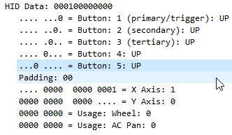

# KuaFu-Arduino-Driver
A driver for the A+ KuaFu 2400 DPI gaming mouse to help use the 2 extra buttons (next, prev) as macros.

Note: 
Set polling interval to something small at the end of HIDComposite::EndpointXtract, in hidcomposite.cpp. 
If you don't, fps games will flick randomly.
